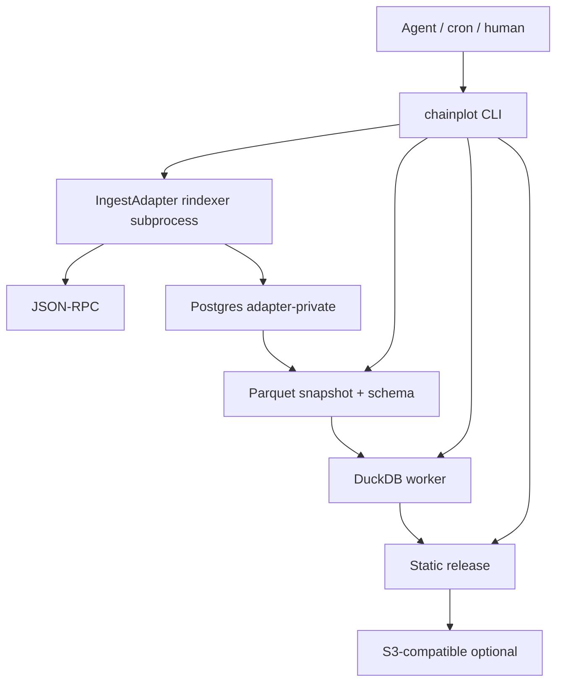

# Chainplot v0.1 design

**Date:** 2026-09-12
**Status:** Implementation baseline. No code, versions, or benchmark results are implied.
**Working name:** Chainplot. CLI: `chainplot`. Name, package, and domain clearance are a launch check, not a v0.1 gate.

Chainplot is an open-source, agent-first toolkit: scoped EVM events become a reproducible Parquet snapshot, SQL models, and a static dashboard. An agent authors files, validates, indexes a bounded range, publishes, and refreshes. Humans read the dashboard and own credentials. No graphical editor, model runtime, or hosted control plane.

> Define the data. Build the insight. Publish anywhere.

---

## 1. Goal

An agent with filesystem and shell access, given this project's documentation, a contract ABI, an explicitly bounded source scope, and authorized credentials, creates and publishes a correct dashboard without browser automation or undocumented manual steps. A second agent forks the published dataset and builds a different dashboard without RPC, Postgres, or the original credentials.

Refresh of a published dashboard is a command the agent, a human, or external cron runs. Chainplot does not sleep in a loop in v0.1.

### 1.1 Non-goals (v0.1)

No Kubernetes manifests, systemd units, `watch` daemon, MCP server, human editor, embedded chatbot, second indexer implementation, plugin loader, public SQL service, multi-tenant hosting, cloud provisioning, traces, chain-wide discovery, factory-address expansion, non-EVM sources, DuckDB-Wasm in the browser, IPFS, or a global dashboard directory.

Unsupported requests return a typed capability error. Do not substitute a plausible metric.

---

## 2. Users

| Role | Does |
|---|---|
| Agent (primary operator) | Author files, run CLI, apply plans, publish, fork, diagnose |
| Human reviewer | Read dashboards, review definitions, own infra and secrets |
| Public reader | Open a static URL. No account, wallet, RPC, or producer |

---

## 3. Invariants

1. **Agent-first.** Files and CLI are the authoring interface. A web editor is not required for usefulness.
2. **Index-once on the read path.** Viewing a dashboard or querying a published snapshot must not generate historical RPC. Refresh is a separate write path.
3. **No mandatory hosted component.** Losing the project website must not stop an existing deployment or published dashboard.
4. **Snapshot is the public data contract.** Models, queries, the viewer, and forks never name indexer tables.
5. **Open artifacts.** SQL, JSON/YAML, Parquet, ABIs, and ordinary static web assets are the portability boundary.
6. **Correctness before convenience.** Missing data, incomplete coverage, stale results, approximation, and unsupported capabilities are explicit.
7. **Small footprint.** Reuse rindexer and DuckDB. Do not build a general orchestrator, indexer, or warehouse.
8. **No required model runtime.** The calling agent supplies intelligence. Chainplot supplies deterministic tools, contracts, and evidence.

---

## 4. Scope

### 4.1 In v0.1

- Declarative project, JSON Schema, CLI with `--json` / `--jsonl`
- One ingest adapter implementation: rindexer (no-code, Postgres, bounded jobs)
- Thin `IngestAdapter` interface so a later similar indexer is a new module, not a core rewrite
- Postgres only while ingesting; not required for dataset-only / fork projects
- Consistent Parquet snapshot; DuckDB only on snapshots
- Static dashboard (line, bar, KPI, table)
- Publish to a local directory and to one S3-compatible adapter
- `refresh` command that resumes indexing, rebuilds, and optionally publishes
- Docker Compose as the tested ingest runtime. The ingest template ships
  `compose.yaml` plus a Dockerfile that packages the CLI and the pinned
  rindexer binary. M2 must pass on one architecture; M5 must smoke Linux
  x86-64 and ARM64. macOS via Compose is acceptable. Native Windows is not
  claimed. A published multi-arch registry image is not a v0.1 product.

### 4.2 Deliberately out

See §1.1. Also out: automatic proxy-upgrade interpretation, curated identity/price feeds, arbitrary historical state reconstruction, mixing latest files from different releases.

---

## 5. Architecture

Two run modes, one CLI:

| Mode | Needs | Does not need |
|---|---|---|
| Ingest project | RPC, Postgres, pinned rindexer binary | — |
| Dataset-only / fork | Snapshot files + CLI | RPC, Postgres, rindexer |



Compose for local ingest: `producer` (CLI + pinned rindexer) + `postgres`. Dataset-only skips Compose.

Logical ownership:

| Component | Owns | Must not own |
|---|---|---|
| Project core | Validation, plans, identity, schemas, policy | Model-provider calls, UI-only config |
| Ingest adapter | Generated upstream config, bounded run, coverage inspection | Dashboard presentation, a second indexer |
| Postgres | Indexed events, upstream checkpoints, advisory lock | Public query endpoint |
| Snapshot / query | Typed export, SQL models, bounded analytics | A second live database of record |
| Builder / publisher | Static artifacts, manifests, `latest` promotion | Ingestion or cloud provisioning |
| Viewer | Cached results, provenance, downloads | RPC, remote SQL, credentials |

---

## 6. Repository layout

One package until a split is forced. Directories are modules, not services.

```text
chainplot/
  docs/specs/                 # this design; later docs/plans/
  schemas/                    # JSON Schema for YAML/JSON documents
  src/cli/
  src/project/
  src/ingest/                 # IngestAdapter + rindexer impl
  src/snapshot/
  src/query/
  src/publish/
  src/runtime/                # subprocess, locks, run journal
  viewer/                     # React + Vite + ECharts
  templates/                  # init scaffolds, including Compose
  tests/
  LICENSE                     # MIT
```

Create `src/` only when implementation starts. This spec does not require those files to exist today.

Tooling defaults (pinned in Milestone 0, not floating `latest`):

- TypeScript on a supported Node.js LTS
- pnpm
- `@duckdb/node-api` (DuckDB Node neo). Do not use the deprecated `duckdb` package
- AWS SDK v3 for the S3 adapter
- Viewer: React, Vite, ECharts
- rindexer: pinned release binary, `project_type: no-code`

---

## 7. Project files

```text
my-analytics/
  chainplot.yaml
  chainplot.lock.json
  abis/
  schemas/
  models/
  queries/
  dashboards/
  tests/
  .env.example
  compose.yaml                # from template; ingest projects only
  .chainplot/                 # gitignored work, plans, runs
  dist/                       # gitignored built releases
```

An agent edits files directly. There are no field-level mutation commands.

`chainplot.yaml` is the source of truth. JSON Schema is authoritative for every YAML/JSON document. Kinds:
`project`, `plan`, `result`, `progress`, `release`, `manifest`,
`latest`, `coverage`, `lock`.

`chainplot schema show <kind>` accepts exactly that set. `capabilities`
advertises it. The same schemas generate types, examples, and docs.
Unknown fields fail validation. All `schema_version` / `format_version`
fields are integers, not strings.

`progress` is the JSONL progress-event envelope, not an event-source
resource. `release` is `release.json`. `manifest` is
`datasets/<id>/manifest.json`. `latest` is the `latest.json` pointer.

Two lock files, different jobs:

- `pnpm-lock.yaml` — Chainplot software dependencies (Node packages).
- `chainplot.lock.json` — the analytics project: tool versions, ABI digests,
  imported snapshot ids, transformation digests. Rebuilding from this lock
  must not silently fetch a publisher's latest data. Updating it is an
  explicit action.

`chainplot.yaml` `format_version` is an integer. Unknown or newer versions
fail `validate` with `unsupported_capability`. v0.1 does not ship a
migrator.

Secrets enter through environment or file references named in `.env.example`. Never command-line literals, never committed values, never public project files.

---

## 8. Resources

Every resource has a **stable ID** distinct from its title. Renaming a dashboard does not recreate an event table.

| Resource | Required |
|---|---|
| Project | Format version, stable id, policy and publication defaults |
| Chain source | Numeric chain id, RPC secret reference, finality policy |
| Event source | Addresses, ABI path and digest, event signatures, inclusive start block, end policy (see below) |
| Dataset schema | Id/version, columns, physical and logical types, nullability, grain, key, units, coverage, provenance |
| SQL model | Id, SQL file, explicit dependencies, expected output schema, assertions |
| Query | Id, SQL file, dataset/model refs, expected columns/types, resource limits, metric definition |
| Dashboard | Id, title, description, ordered panels, query refs, allowlisted chart encodings |
| Publish target | `directory` or `s3`, credential references, public-data selection, optional public base URL |

v0.1 event sources: **explicit address lists** on **one chain**. No factory
discovery, no chain-wide event filters, no multi-network project.

End policy on each event source is one of:

- `pinned` — `end_block` is a number. `refresh` does not ingest further
  (it may still rebuild queries/presentation).
- `follow_finalized` — each refresh resolves `resolved_safe_end` (see
  below), capped by the run's block budget, and sets that as `end_block`
  for the rindexer job.

`resolved_safe_end` is the finalized block. `follow_finalized` therefore
requires chain finality policy `finalized` (§9.2). `confirmation_depth`
applies only to `pinned` sources, whose declared `end_block` must
already satisfy ≤ head − confirmation_depth at plan time.

`start_block` and `end_block` are inclusive integers. A run covers
`end - start + 1` blocks. Both ends are always written into the generated
rindexer config. There is no "live index from now" mode.

At plan time a `pinned` `end_block` must already satisfy the chain
source's finality policy (≤ finalized, or ≤ head − confirmation_depth).
Otherwise `plan` fails with `policy_refused`. Pinning into the unfinalized
zone is not a labeled special case in v0.1; it is refused.

Source event schemas are derived from the ABI and verified against indexed columns. Agents may rename columns and define derived schemas. They cannot redefine an ABI type without an explicit checked transformation.

Change classification in plans:

| Class | Example | Command / intent |
|---|---|---|
| Presentation-only | Dashboard title | `plan --intent build` then `apply` (or `build`) |
| Query rebuild | SQL text | `plan --intent build` then `apply` (or `build`) |
| Snapshot rebuild | Model graph | `plan --intent build` then `apply` (or `build`) |
| Additional backfill | Earlier start, new address | `plan --intent ingest` then `apply` |
| Continue pinned ingest | Proven end below declared `end_block` (budget split or crash) | Repeated `plan --intent ingest` then `apply`. Not `refresh`. |
| Follow-head ingest | `follow_finalized` advance | `plan --intent refresh` then `apply` (or `refresh`) |
| Publish existing release | Upload `dist/` | `plan --intent publish` then `apply` (or `publish`) |
| Incompatible | Schema/grain/chain identity | Refuse; new version or separately authorized destructive plan |

`build` never talks to RPC. It produces a staging release under `dist/`
from an existing complete snapshot (re-export models if the graph
changed, re-run queries, write static assets). A2 maps to `build`.

Never automatically drop existing data to fit an incompatible change.

---

## 9. CLI

All commands are noninteractive. `--json` emits exactly one result object on stdout; diagnostics go to stderr. Long operations also accept `--jsonl`: versioned progress events, then one final result. Never mix spinner animation or upstream plaintext into structured stdout.

Result envelope:

```json
{
  "schema_version": 1,
  "ok": true,
  "command": "validate",
  "data": {},
  "warnings": [],
  "error": null
}
```

On failure, `ok` is false and `error` is:

```json
{
  "code": "policy_refused",
  "message": "human readable",
  "resource_id": "src.transfers",
  "pointer": "/event_sources/0/end",
  "retryable": false,
  "suggested_next": "plan --intent ingest"
}
```

`error.code` is a closed enum. v0.1 values:

`validation`, `missing_credentials`, `unsupported_capability`,
`policy_refused`, `source_inconsistent`, `transient_dependency`,
`internal`.

Do not invent ad-hoc codes per command. Details go in `message`,
`resource_id`, and `pointer`.

### 9.1 Commands

| Command | Network | Job |
|---|---|---|
| `capabilities` | no | Versions, supported sources/targets/charts, limits, schema versions |
| `schema show <kind>` | no | Full local JSON Schema for one of: `project`, `plan`, `result`, `progress`, `release`, `manifest`, `latest`, `coverage`, `lock` |
| `templates list` | no | Template ids, required inputs, limitations |
| `init --template --output` | no | Scaffold; fail if files would collide |
| `validate` | no | Syntax, schema, refs, ABI, model graph, and static policy combos (including `follow_finalized` + `confirmation_depth` → `unsupported_capability`) |
| `doctor` | yes | Creds present, chain id, RPC methods, Postgres, rindexer binary, writable storage, S3 if configured. S3 check is a non-mutating API call (e.g. HeadBucket), never a write. Output must mark S3 **write/promote** capability as `unverified`. Write permission is proven only at upload time. |
| `plan --intent ingest\|refresh\|build\|publish` | read-only probes | Write a plan file; mutate nothing |
| `apply --plan` | as planned | Execute that plan only |
| `build` | no RPC; HTTPS snapshot fetch only in `dataset_referenced` mode (§16.4, §14.1 caps) | Sugar over `plan --intent build` plus `apply`. Staging release in `dist/` from an existing snapshot. Cache already present → no network. |
| `refresh [--publish-target]` | as planned | Sugar over `plan --intent refresh` plus `apply`. Optional publish of the new release. |
| `query --file --snapshot` | no RPC; HTTPS snapshot fetch only in `dataset_referenced` mode (§16.4, §14.1 caps) | DuckDB on a materialized snapshot. Cache already present → no network. |
| `dataset describe <id>` | no RPC; HTTPS snapshot fetch only in `dataset_referenced` mode (§16.4, §14.1 caps) | Schema, coverage, freshness, dataset mode; optional sample. Cache already present → no network. |
| `test` | no | Declared assertions against data already on disk. Missing local data fails with `validation`; `test` does not fetch. |
| `publish` | as targeted | Publication-only plan for an already-built release |
| `fork` | optional HTTPS fetch | Import local dir or release URL; do not execute recipes |
| `serve` | loopback only (`127.0.0.1`) | Preview trusted static output. Refuse `0.0.0.0`. |
| `runs list\|show\|cancel` | no | Journal. Cancel is cooperative: forward signal, keep recoverable state |

No `deploy render`. No `watch`. `init` copies `compose.yaml` for ingest templates.

`validate` must work with RPC, Postgres, and credentials absent. `doctor` must not start unbounded indexing.

### 9.2 Plan and apply

A plan is digest-bound authorization. It includes:

- Project, source, and dependency digests
- Current-state assumptions
- Resolved chain and block interval
- Ordered actions, affected resources, whether any action deletes data or makes data public
- Enforced limits; estimates that cannot be computed are `unknown`, never invented
- Public file/column selection and destination when publishing

`apply` refuses if configuration, policy, source identity, or state
assumptions drifted. Routine movement of chain head does not invalidate a
**finalized** pinned range (the pin was already ≤ finalized at plan time).
A changed canonical boundary or changed source definition does.

A plan does not authorize extra spend, a wider backfill, installing
software, provisioning cloud resources, or publishing to another
destination. No flag widens a plan's scope or destination. Destructive and
public-data actions must appear in the plan.

`refresh` may execute only actions already authorized by the project file
and the last successfully applied plan: same addresses, same public column
selection, same publish destination, block count ≤ budget. The generated
plan is still written to the run journal. `--publish-target` must name a
target already in `chainplot.yaml`. Anything else fails with
`policy_refused` and needs an out-of-band `plan` + `apply`.

Same plan digest + idempotency key: resume or return the existing outcome.
Do not duplicate ingestion or mix files from two releases. Do not claim
globally exactly-once execution.

Idempotency key defaults to the plan digest. Override with
`--idempotency-key`. Journal path:
`.chainplot/runs/<idempotency-key>/` containing the plan copy, status,
child pid, and checkpoints. A second `apply` with the same key and a
**different** plan digest fails with `policy_refused`.

`last_proven_complete_block` is per event source, derived from coverage
rows (not a separate checkpoint): the end of the contiguous complete
segment chain that starts at that source's project `start_block`.
Sources on the same project may differ. With **no** coverage rows,
`last_proven_complete_block` is `start_block − 1`, so the first run
begins at the project `start_block`.

Every ingest job (refresh or `plan --intent ingest`) uses inclusive
bounds:

- `job_start = last_proven_complete_block + 1`
- `job_end = min(job_target_end, job_start + block_budget - 1)`
  where `job_target_end` is the declared `end_block` for `pinned`
  and `resolved_safe_end` for `follow_finalized`

If `job_start > job_end`, ingest is a no-op and coverage is unchanged.

v0.1 does **not** re-ingest an overlap tail. Jobs only append. Interior
reorg handling for a live unfinalized window is follow-on.

Therefore `follow_finalized` requires chain finality policy `finalized`.
`follow_finalized` + `confirmation_depth` is `unsupported_capability` at
`plan` time. `confirmation_depth` remains valid for **pinned** sources:
the pinned `end_block` must already satisfy the depth at plan time
(§8). Those snapshots are labeled confirmation-based.

`pinned` sources skip ingest on **refresh**. A pinned source with
`last_proven_complete_block < end_block` is finished by repeated
out-of-band `plan --intent ingest` + `apply` (budget split or resume
after a consumed plan).

Coverage is stored per contiguous segment. Each coverage segment records `start_block`, `end_block`,
`start_block_hash`, `end_block_hash`, and `start_block_parent_hash`
(from the same header fetches as §12; no extra RPC). Adjacent segments
A then B are **hash-joined** iff `B.start_block = A.end_block + 1` and
`B.start_block_parent_hash = A.end_block_hash`. Number-adjacent without
that parent link is `source_inconsistent`, not complete.

A snapshot is **complete** for a source only when contiguous hash-joined
complete segments cover `[start_block, required_end]`:

- `pinned`: `required_end` is the declared `end_block`
- `follow_finalized`: `required_end` is the maximum `end_block` over
  that source's recorded coverage segments. A job that wrote no coverage
  segment contributes nothing. This is not `resolved_safe_end` (that is
  `job_target_end`). With no coverage segments, `required_end` is
  undefined and the source is `not_indexed`, never `complete`. A release
  containing it must not be promoted. Under append-only hash-joined
  segments this equals `last_proven_complete_block` whenever coverage is
  contiguous.

If `resolved_safe_end < start_block` for a `follow_finalized` source,
`plan` fails with `policy_refused` (start is in the future relative to
finalized head).

A gap, hash mismatch, or proven end below that `required_end` is
`incomplete` and must not be promoted. A pinned source killed at 60% of
its range is incomplete even though it has a single gap-free segment.

`resolved_safe_end > required_end` is a normal lagging-but-complete
state. Report it as freshness lag in `manifest.json`, `dataset describe`,
and the viewer chip — not as `incomplete`. Catch-up is later refresh
jobs, each ≤ block budget.

`refresh` vs a dirty working tree:

- Model SQL, query SQL, dashboard presentation: rebuild (`build` class).
  Cron may publish those; they do not widen ingest or public-data
  selection.
- Addresses, start/end, public columns, destination, or chain identity:
  `policy_refused`. Needs an out-of-band plan.

If there is **no** last successfully applied plan (fresh clone, first
machine, fork that only ran `build`), `refresh` derives authorization
from the project file alone and may ingest only if that does not widen
beyond the file (first `follow_finalized` run from `start_block` is
allowed; changing destination is not).

Dedup on resume or re-apply of a partial segment: physical uniqueness
from §12. Duplicate delivery of the **same canonical log** must not
produce duplicate snapshot rows. A row that matches the unique key with
a **different** `block_hash` is a reorg: `source_inconsistent`.

New addresses, earlier start, new public columns, or a new destination
require an out-of-band ingest or publish plan.

Progress events report completed coverage, current stage, rows, output bytes, retries, heartbeat, last successful release. Do not invent a completion percentage when the total is unknown. Samples default to 20 rows.

---

## 10. Ingest adapter

### 10.1 Interface

One TypeScript interface, one v0.1 implementation (`rindexer`). No plugin loader, no user-facing `indexer:` driver field, no second stub.

```ts
interface IngestAdapter {
  renderConfig(input: RenderConfigInput): GeneratedConfig;
  runBounded(job: BoundedJob): Promise<RunHandle>;
  stopAndQuiesce(handle: RunHandle): Promise<void>;
  inspectCoverage(job: BoundedJob): Promise<CoverageReport>;
}
```

Call `inspectCoverage` only after `stopAndQuiesce`. The report must
distinguish `not_indexed`, `incomplete`, `complete_empty`, and
`complete_with_rows`. Maximum observed event block is not completeness.

A later indexer that can run a bounded EVM-event job, stop writing, and prove coverage including empty ranges is a new module behind this interface. Indexers that only head-follow, only expose GraphQL, or cannot prove empty-range coverage do not fit; those datasets enter via snapshot import.

### 10.2 rindexer implementation

Generate gitignored upstream YAML from `chainplot.yaml`. Do not copy rindexer's full config surface into Chainplot.

Required generated settings (Milestone 0 must verify against the pinned version):

- `project_type: no-code`
- Postgres storage enabled; GraphQL, streams, chatbots, CSV, and Docker-socket DB provisioning disabled
- **Always set `start_block` and `end_block`.** Upstream without `start_block` indexes from "now" and does not track last-synced block across restarts. Upstream without `end_block` live-indexes. Chainplot never uses those modes in v0.1
- Explicit contract addresses only (not `factory`, not chain-wide `filter`)
- `include_events` limited to the declared signatures
- RPC URL from the secret reference, not from committed files

Parent process: forward termination signals, reap children, impose the RPC-job wall-clock limit, persist run state.

One active ingest writer per project. Postgres advisory lock plus a
local lock file. Concurrent `apply` on the same project fails with
`policy_refused`. Publish without Postgres uses the local lock plus the
S3 conditional write on `latest.json` (§16.2).

Dashboard SQL never depends on rindexer's table-naming (contract `name` drives upstream table names). The snapshot exporter maps to logical tables defined in `schemas/`.

---

## 11. Coverage and finality

A published **complete** snapshot requires evidence of complete ingestion
for every selected source over `[start_block, required_end]` as defined
in §9.2, including ranges with zero matching events. A truncated pinned
range is incomplete.

M0 must name the concrete upstream evidence (which rindexer table/column,
or which Chainplot-written coverage row) that proves last-synced block
per contract. "Max event block" is not that evidence. If the pinned
rindexer cannot prove empty-range completeness, `plan` refuses that
configuration with `unsupported_capability` before ingest. v0.1 never
labels an interval complete without positive evidence.

**Finality policy** is explicit on the chain source:

- `finalized` — use the RPC finalized block. If the node cannot supply it, fail. Do not fall back.
- `confirmation_depth` — integer depth, labeled confirmation-based in every manifest and viewer chip. Not equivalent to protocol finality.

Never silently index unconfirmed head.

Record start/end block numbers, `start_block_hash`, `end_block_hash`,
`start_block_parent_hash`, source ids, ABI digest, chain id, finality
policy, generation time, and transformation digests.

Before a refresh that **ingests** (advances proven coverage): the
previous published end-boundary hash must still be canonical. Mismatch
blocks promotion. Keep the last complete release. Repair is a
documented rebuild, not a silent skip.

A refresh that performs no ingest performs no canonicality check. It
performs no RPC when every source is `pinned`, or in dataset-only /
fork / presentation-rebuild projects. A `follow_finalized` source still costs one finalized-head probe per
refresh to resolve `resolved_safe_end`, **in addition to** any
canonicality and coverage-boundary header fetches when that refresh
ingests. If the head probe fails, refresh fails with
`transient_dependency` and coverage is unchanged. `job_start > job_end`
is decided **after** that probe.

Milestone 0 must test: interrupted batches, duplicate delivery,
zero-event ranges, restart resume from `last_proven_complete_block + 1`,
inclusive `end_block` arithmetic, a pinned range stopped below
`end_block` (must stay `incomplete`), a controlled canonical-boundary
change, a two-segment cross-reorg that breaks
`start_block_parent_hash` join (do not treat as complete), a zero-event
segment that still records both boundary hashes and fails promotion on
a boundary-hash change, and that `follow_finalized` +
`confirmation_depth` is refused at plan time. If the pinned rindexer
cannot meet a required safety for a configuration, reject that
configuration. Do not write a second indexer to paper over it.

---

## 12. Snapshot and types

Default snapshot happens after the bounded upstream run has **stopped writing**. Read selected tables and coverage metadata from one coherent database snapshot. Do not stitch independent reads and call them one point in time.

Milestone 0 chooses **one** export path and records it:

1. DuckDB Postgres extension, if type mapping and transaction behavior pass tests, or
2. One explicit Postgres read transaction to stage tables, then DuckDB

Do not maintain both forever.

Each event table includes: `chain_id`, `contract_address`, `block_number`,
`block_hash`, `tx_hash`, `log_index`, `block_timestamp`. Do not infer
timestamps from average block time.

Milestone 0 must check whether the pinned rindexer persists per-log
`block_hash` and `block_timestamp`. If yes, use them and skip enrichment.
If no, Chainplot runs an enrichment stage **after** `stopAndQuiesce` and
**before** snapshot export.

In **either** case, header fetches for coverage always include
`segment start_block` and `segment end_block`, even when those blocks
have zero matching logs (A6). Plus distinct `block_number` values that
did produce logs, if timestamps/hashes are not already on the log
rows. Those fetches count against the §14.1 distinct-header limit. A
missing header makes the segment `incomplete` (`transient_dependency`
if the RPC failed; `source_inconsistent` if the block vanished).
Boundary hashes used in §11 come from these header fetches, not from
“some log happened to land on the boundary.”

Physical uniqueness: `(chain_id, block_number, tx_hash, log_index)`.
That key is one canonical log. The same key with a different
`block_hash` is a reorg, not a second row: `source_inconsistent`. Do
not keep both. Logical grain is declared on the dataset schema.

Canonical formatting: lowercase hex for addresses and hashes, UTC timestamps, declared nullability. Overloaded event signatures and reserved column names are handled explicitly. Nested ABI types we cannot map fail validation.

**Wide integers (`uint256`, `int256`, and any integer wider than JS
safe integer):**

- Portable JSON, CLI, and Parquet raw amounts: validated decimal
  **string**. Signed values use a leading `-` for negatives. No JavaScript
  `number`.
- Do not auto-cast every uint256/int256 to DuckDB `DECIMAL` (max 38
  digits; 256-bit needs 78).
- Raw display (KPI raw, table raw column, A8) must show the exact
  decimal string.
- `ORDER BY` on a raw-amount column is forbidden. Models that need
  order over amounts must emit a dedicated sort key (zero-padded
  fixed-width decimal string, sign-aware) and `ORDER BY` that key.
- Analytical columns that need numeric ops declare: token decimals,
  precision class (`exact` or `approximate`), and target DuckDB type.
  A checked cast that overflows an `exact` column fails the query; the
  cached result is an error object, and the viewer shows that error — not
  a rounded number, not an empty chart pretending success.
  `approximate` is allowed only when the metric schema says so; the
  viewer chip must say approximated.
- Use DuckDB neo `getRowsJson()` / JSON converters for CLI JSON.

Acceptance A8: `0`, `1`, `-1`, `2^53+1`, `-2^53-1`, `2^255-1`,
`-2^255`, `2^256-1` round-trip as raw strings. A9-adjacent ordering
fixture: sort those values via the sort key, not lexicographic strings.

---

## 13. SQL models and queries

Materialize scoped source tables from the snapshot, apply declared `SELECT` models in dependency order, execute queries against that snapshot.

- No arbitrary DDL, no shell lifecycle hooks, no incremental-model framework in v0.1
- Cycles fail `validate`
- Queries and results identify snapshot id, schema version, query digest, output types, units, execution stats
- Published chart/table output requires explicit stable `ORDER BY`.
  Do not `ORDER BY` a raw decimal-string amount column (see §12).
- Time-dependent SQL uses the snapshot's analysis timestamp, not `now()`
- Parameters are typed and bound, never concatenated

Assertions cover keys, nullability, types/ranges, expected columns, and template-specific invariants. A dataset can be well-formed and semantically wrong; metric descriptions and exclusions make interpretation reviewable, not automatically true.

---

## 14. Isolation, trust, limits

Project owners and their agents may write SQL. Public viewers cannot submit SQL to the producer. Imported manifests, ABI text, data values, and dashboard copy are untrusted data, not instructions.

`fork` copies files and pins snapshots. It does not execute imported recipes, install extensions, or run hooks. The schema format cannot embed shell commands or JavaScript callbacks.

DuckDB runs in a child process with snapshot files and a temp dir only. RPC, Postgres, and publication credentials are stripped from its environment. Disable extension install and external access after setup. Apply query time, memory, thread, and output limits.

This is a trusted-owner tool, not a multi-tenant sandbox. Unreviewed imported SQL is never auto-run. If a deployment cannot isolate the worker, refuse untrusted-execution requests rather than claim parser safety. Do not mount a Docker socket to wrap each query.

### 14.1 Enforced v0.1 limits

These are safety limits, not performance promises. Query, output, and
publication-size limits are typed refusals with choices (narrow scope,
publish aggregates, raise the policy). Never silent truncation of a
published metric. Never synthetic live data outside visibly marked
fixtures.

The **block budget** is the exception: it **caps** `job_end` per §9.2.
`plan` must show the resolved interval and blocks remaining. A
200_000-block pinned range becomes two sequential authorized ingest
plans, not `policy_refused` on the first.

| Limit | Default |
|---|---|
| Chains per project | 1 |
| Contract addresses | 20 |
| Blocks in the resolved inclusive `[start, end]` of one approved run | 100_000 |
| Distinct block-header fetches per approved run (coverage boundaries always; enrichment when needed) | 100_000 |
| Query deadline | 60 s |
| DuckDB memory target | 1 GiB |
| Returned rows | 10_000 |
| RPC job wall clock | 30 min, resumable |
| Copied public dataset | 100 MiB compressed |
| Cached query results | 5 MiB total |
| CLI sample rows | 20 |
| Concurrent ingest/publish per project | 1 |
| `fork` `release.json` body | 1 MiB |
| `fork` total download | 512 MiB, streaming abort, independent of declared size |
| `fork` per-request timeout | 30 s |
| `fork` redirect hops | 0 (redirects forbidden) |

The block budget applies to the **first ingest** as well as refresh.

A block-range limit is not an RPC billing cap. Do not invent dollar costs.

---

## 15. Viewer

Ship a responsive viewer with line charts, bar charts, KPI values, and tables. Allowlisted chart encodings only. No user JavaScript formatters, no arbitrary HTML.

Display: freshness, coverage, finality policy (including
confirmation-based labeling), units, query source, and dataset mode
(`results_only` | `dataset_included` | `dataset_referenced`). The viewer at the target root loads `latest.json` (via the bootstrap in
§16.1) to resolve which release to render. A pinned URL opens
`releases/<id>/index.html` and skips the pointer.

v0.1 interactions operate only on published result rows: sort, toggle
series, displayed range, table search. Sort of a raw-amount column must
use the published sort key or a numeric compare of the decimal string,
never JavaScript/`localeCompare` string order. A control must not imply
it can fetch missing history or rerun SQL when that capability is absent.

Readers need no account, wallet, RPC, producer, or database. Works on ordinary HTTP(S) under a configurable base path. `file://` is not promised. No third-party CDN.

---

## 16. Release, publish, fork

### 16.1 Release layout

```text
<target>/
  index.html                  # bootstrap; fetches latest.json
  assets/                     # release-independent viewer loader
  latest.json                 # pointer: prefix + checksum
  releases/<release-id>/
    index.html
    assets/
    release.json
    dashboards/
    results/
    datasets/<snapshot-id>/
      manifest.json
      tables/*.parquet
    source/
```

`latest.json` is never stored inside `releases/<release-id>/`.

Root `index.html` + root `assets/` are a version-stable bootstrap: fetch
`latest.json`, which carries the release prefix and the checksum of that
release's `release.json`. Verify `release.json` against that checksum;
`release.json` carries per-file checksums used before loading assets.
Promotion stays a single `latest.json` write. Rewrite the bootstrap only
when the viewer loader itself changes, not when data refreshes. Opening
`releases/<id>/index.html` is the pinned URL and skips the pointer.

`source/` is an explicit allowlist of sanitized recipe files. No secrets, no `.env`, no run logs, no absolute machine paths.

A release may copy selected public data (standalone) or reference an external pinned dataset. Exceeding the size limit fails unless the agent chooses reference mode, reduces data, or publishes results-only.

Manifests distinguish the three modes. The viewer must not claim arbitrary SQL remixing when only cached results were published. Forking results-only yields a recipe, not the missing source data.

### 16.2 Publication protocol

1. `build` writes a staging release (or `apply` of a build/refresh plan does)
2. Validate schemas, references, query success, allowlist, checksums, size.
   S3 write/promote permission is proven only here, not by `doctor`.
3. Upload immutable release files
4. Verify
5. Promote `latest` last

Prefer immutable release addresses for citations. `latest` is **one
small pointer object** `latest.json` containing the immutable release
prefix and the checksum of that prefix's `release.json`. The viewer resolves it at load. Promotion is a
single object write after all immutable files are uploaded and verified.
Never copy a whole release into a `latest/` directory.

Filesystem target: atomic replace of `latest.json` on the same
filesystem (write to a temp name, `rename`). S3-compatible target:
conditional write of `latest.json` (`If-Match` / `If-None-Match` on the
current pointer). Milestone 0 must verify **conditional-write and
read-after-write** on AWS S3 and at least one S3-compatible endpoint. If
the target cannot do that, refuse the target.

Dataset-only publish has no Postgres. Cross-host exclusion for S3 is the
conditional write on `latest.json` plus a local lock file (same-host
only). Two hosts without a working conditional write are unsupported;
refuse rather than last-write-wins.

Interrupted upload leaves the previous complete release. Checksums
detect corruption; they are not proof of analytical truth or authorship.

v0.1 retention is **manual**. No `prune` command. Automated GC is
follow-on. Operators who delete objects under a prefix still referenced
by `latest.json` or by a cached pointer get a broken URL; that is
outside the product until prune exists.

Software license (MIT) is not dataset license. Publishing requires an explicit dataset-license field. Schema descriptions can leak; they are in the allowlist review.

Secret-shaped scanning is best-effort, not a proof that data is safe to publish.

### 16.3 S3 adapter

One adapter using AWS SDK v3 against an S3 API. Bucket already provisioned. Credentials via env/file reference. Chainplot does not create buckets or IAM.

### 16.4 Fork

Start from `release.json`, not scraped HTML.

Order: validate `latest.json` against kind `latest` (if present), then
`release.json` against kind `release`, then each dataset `manifest.json`
against kind `manifest`. Check format version, allowlisted paths, and
declared sizes against §14.1 **before** downloading bodies;
stream bodies with a hard byte cap; verify checksums as bytes arrive;
abort on cap, timeout, or mismatch. Declared size is not trusted as an
upper bound.

Fetch rules (deny by default):

- Local directory, or `https` URL
- Redirects forbidden
- Resolve DNS; validate **every** resolved address against a blocklist:
  loopback (IPv4 `127.0.0.0/8`, IPv6 `::1`), link-local (`169.254.0.0/16`,
  `fe80::/10`), ULA `fc00::/7`, RFC1918, CGNAT `100.64.0.0/10`,
  unspecified (`0.0.0.0`, `::`), IPv4-mapped IPv6 forms of any of the
  above. Reject decimal/octal/hex IP literals that decode to a blocked
  address.
- Pin the resolved address for the connection (or re-validate on
  connect) to defeat DNS rebinding
- Block path traversal and undeclared files
- Cross-origin references require explicit allowed origins
- Escape hatch for private networks is an explicit, documented flag;
  default off

Fork creates a new project with pinned snapshots and copied
query/dashboard definitions. No chain access is required for new SQL
over included data. Expanding history or changing contracts is a new
ingest plan.

Dataset mode is the one vocabulary. `dataset describe` and fork output
use the same strings as the viewer:

| Mode | What the fork obtained |
|---|---|
| `results_only` | Recipe and cached results. No snapshot. New SQL over source tables is impossible until data is obtained another way. |
| `dataset_referenced` | Pointer to an external pinned snapshot. The CLI, not DuckDB, fetches it into `.chainplot/cache/snapshots/<id>/` under §16.4 rules and §14.1 fork caps, verifies the pinned checksum, then hands **local files** to the isolated worker. Failed fetch: `transient_dependency`. `query` / `dataset describe` / `build` materialize the cache first. `test` still requires data already on disk and does not fetch. |
| `dataset_included` | Copied snapshot. New SQL over included data, no RPC. |
| (not a mode) | Running the recipe to keep freshness is a **new ingest project**, not implied by fork. |

---

## 17. Compose and operation

v0.1 tested ingest runtime: Docker Compose with producer + Postgres, explicit volumes, secret references, no Docker socket mounted into the producer.

`init` ingest template includes `compose.yaml`. The agent (or human) applies it with Docker. Chainplot does not SSH, does not speak Kubernetes, and does not install operators.

Dataset-only path: CLI + imported snapshot, network disabled, A15.

Persistence:

- Postgres: indexed data and upstream progress
- Project + lockfile: version-controlled inputs
- `.chainplot/`: run journal and caches
- `dist/` or the publish target: public output
- Native DuckDB files: disposable

Switching RPC URL must not invalidate otherwise compatible chain data. Changing chain id fails validation.

Refresh is a command. Document a cron one-liner that runs `chainplot refresh --publish-target <id>` from the project directory. Do not ship `watch`.

---

## 18. Definition of done

v0.1 is done when A1–A16 pass on fixtures (and Compose for A11). Live-chain smoke is opt-in and bounded, not the only evidence. Expected results are independently specified, not generated solely by the pipeline under test.

| ID | Test | Required outcome |
|---|---|---|
| A1 | Agent creates a dashboard from ABI, contract scope, bounded fixture history | No browser automation or undocumented manual step; correct dataset and charts |
| A2 | Agent changes a chart title and runs `build` | Presentation rebuild only; no backfill |
| A3 | Agent requests earlier history or another contract | Explicit additional work; no silent expansion |
| A4 | Kill producer during indexing, export, and upload | Safe resume; previous complete public release remains usable |
| A5 | Apply the same plan and idempotency key twice | No duplicate logical data or mixed release |
| A6 | Source with no matching events for the whole interval | Either coverage is `complete_empty`, or `plan` refuses the configuration with `unsupported_capability` before ingest. Never report complete without positive evidence. |
| A7 | Change the canonical chain boundary in a fixture | Detect inconsistency; do not promote |
| A8 | Export `0`, `1`, `-1`, `2^53+1`, `-2^53-1`, `2^255-1`, `-2^255`, `2^256-1` as raw amounts | Exact round-trip through storage, dataset, JSON, and displayed raw values. Sort-key order over that set is numeric, not lexicographic. |
| A9 | Stop producer and database; block RPC | Public dashboard still renders |
| A10 | Second agent imports published data and writes a new query | New dashboard without reindexing or original credentials |
| A11 | Copy the project onto a clean machine and run Compose | Config changes are environmental, not rewritten analytics |
| A12 | Malicious filenames, labels, metadata, SQL, secret-like content | No automatic recipe execution, path escape, credential exposure, or unsupported safety claim |
| A13 | Exceed query, scope, output, or publication limits | Typed refusal; no silent truncation or partial success marked complete |
| A14 | Missing secrets or wrong chain identity | Precise diagnosis, no hanging prompt, no destructive fallback |
| A15 | Fixture-only quickstart with network disabled | Works from packaged assets and local data |
| A16 | After a local SQL/dashboard edit, `refresh` on a project whose sources are `pinned` and already complete, with an existing publish target | Rebuilds and may publish; no ingest. After an address or destination edit, `refresh` returns `policy_refused`. |

Measure later, do not promise now: agent completion rate, interventions, time to first valid dashboard, extra RPC on refresh, publication size, recovery success.

---

## 19. Implementation sequence

Each milestone is independently reviewable. Viewer work can start against fixture snapshots once schema contracts from M1 exist. Do not parallelize contradictory snapshot or identity designs.

### M0 — Prove the dependency path (throwaway probe)

Pin Node LTS, rindexer, DuckDB, `@duckdb/node-api`, AWS SDK. Choose the
snapshot export path. Verify:

- rindexer inclusive `start_block`/`end_block`, resume from
  `last_proven_complete_block + 1`, empty-range evidence source (exact
  table/column)
- whether rindexer persists per-log `block_hash` / `block_timestamp`
- `follow_finalized` requires `finalized`; `confirmation_depth` is
  pinned-only in v0.1
- uint256/int256 through Postgres as strings
- DuckDB max exact decimal width vs overflow display
- S3 conditional-write (`If-Match` / `If-None-Match`) and
  read-after-write, not just overwrite/list

**Gate:** Failed assumption narrows this spec with a recorded amendment. Do not build the rest of the CLI around a lie.

### M1 — Agent contract and fixture-only product

JSON Schema (including `progress` events), CLI
discovery/init/validate/describe/query/test/`build`, structured errors.
One fixture project: one table, one chart, no RPC.

M1 `build` is narrower than the full §8 definition: it emits typed
query results plus `release.json` / `manifest.json` for the fixture
snapshot. It does **not** re-export a model graph or write viewer static
assets. M3 extends `build` to those. The M1 fixture chart is a cached
result document, not a rendered HTML dashboard.

**Gate:** An agent can learn the interface from installed help and schemas without reading `src/`.

### M2 — Ingest and snapshots

rindexer adapter, generated config, coverage, plan/apply/refresh, locks,
exporter, run journal, cancel, Compose + Dockerfile, hard scope limits.
Pass on one CPU architecture.

**Gate:** Incomplete data cannot be promoted as a complete snapshot.

### M3 — Models, dashboards, static build

SELECT model graph, typed results, assertions, viewer, provenance,
sanitized source bundle, `serve`. Extend `build` to re-export models and
write static assets into `dist/`.

**Gate:** Public dashboard works with producer, database, RPC, and CDN unavailable.

### M4 — Publish and fork

Release manifests, immutable prefixes, `latest.json` conditional
promotion, directory + S3, publication plans, dataset modes, fork/import
with SSRF rules, checksums.

**Gate:** Failed upload leaves previous release; another agent forks using only published data.

### M5 — Examples and acceptance

Three examples: transfer activity; protocol deposit/withdrawal; fork of a
published dataset. Docs, capability matrix, MIT + upstream notices,
separate dataset license statements. Run A1–A16. Smoke the Compose
Dockerfile on Linux x86-64 and ARM64.

**Gate:** Fix interface and correctness problems before new source types or a human editor.

---

## 20. Key decisions

| Decision | Rationale |
|---|---|
| v0.1 = local loop + one S3 publish | Sharing beyond the laptop without K8s/systemd/watch |
| Refresh is a command, not a daemon | Updates the published dash; scheduler stays with cron/CI |
| End policy `pinned` vs `follow_finalized` | Refresh must not invent an end block for a pinned range |
| Block budget applies to first ingest | No silent "first run is unlimited" exception |
| Compose + Dockerfile, not a published image | Matches the ops cut; A11 still has a reproducible runtime |
| Two lock files | Software pin (`pnpm-lock.yaml`) vs project pin (`chainplot.lock.json`) |
| TypeScript throughout | Viewer is TS; JSON Schema → types; DuckDB/rindexer already own native work. “Static binary” is illusory (libduckdb + rindexer still ship) |
| Thin `IngestAdapter`, rindexer-only impl | Snapshot is the swap boundary. A cousin indexer is a later module. A plugin system is unused abstraction |
| Snapshot-centric; DuckDB never on live Postgres | Index-once read path; consistent export |
| Always pass rindexer `start_block` and `end_block` | Upstream live-index modes do not resume safely |
| Explicit addresses, one chain | Factory/filter/multi-network are discovery, not v0.1 |
| Wide integers as decimal strings; sort keys; overflow is an error result | JS `number` and DuckDB `DECIMAL(38)` are lossy; lexicographic `ORDER BY` is wrong |
| Plan digest is authorization; `refresh` only replays already-authorized class | No flag widens scope; cron cannot expand public data |
| `build` is the no-RPC path to `dist/` | Only a `dataset_referenced` cache miss touches the network |
| Refresh ingest starts at `last_proven_complete_block + 1` | Re-scanning from project start blows the budget and duplicates rows |
| `latest.json` single-object pointer + S3 conditional write | Multi-object `latest/` copy cannot be atomic |
| Pinned `end_block` must already be finalized | Otherwise “complete” snapshots sit on reorg-able head |
| Fork deny-by-default destinations, no redirects, streaming byte cap | `release.json` is attacker-controlled |
| `dataset_referenced` fetch is CLI cache, not DuckDB HTTP | Isolation stays; referenced mode still works |
| Completeness is `[start, required_end]`, not “any gap-free prefix” | Truncated pinned ingest must not promote |
| `follow_finalized` completeness `required_end` is ingested coverage max, not `job_target_end` | Budget-capped catch-up is lag, not incomplete |
| Root bootstrap `index.html` resolves `latest.json` | Public URL has an entry point; promotion stays one object |
| Unique key is `(chain_id, block_number, tx_hash, log_index)`; hash conflict is reorg | Do not keep both rows |
| `follow_finalized` requires protocol `finalized`; jobs only append | Overlap-replace is a second write path into live event tables. Live unfinalized window is follow-on. |
| M1 `build` emits results JSON; M3 adds static assets | Milestone gates stay evaluable |
| v0.1 retention is manual; no `prune` | Destructive public delete needs a later plan class |
| Compose only as tested runtime | Matches v0.1 ops cut |
| One package, modules by responsibility | Split when a boundary is forced, not upfront |
| pnpm, ECharts, `@duckdb/node-api` | Defaults; versions locked in M0 |
| MIT for software; dataset license is a publish field | Mixing them hides reuse terms |
| Docs live in `docs/specs/` and later `docs/plans/` | No skill-branded folder |

---

## 21. Open questions

Resolved in this spec unless Milestone 0 contradicts them. Remaining:

1. **Exact pins** — Node/`@duckdb/node-api` in M1 lockfile. rindexer image
   digest in `docs/compatibility.md` (GHCR `v0.43.1` tag missing; `:latest`
   digest pinned 2026-09-13).
2. **Launch name/domain/npm** — not a v0.1 implementation gate.
3. **Empty-range evidence** — **resolved:**
   `rindexer_internal.{indexer}_{contract}_{event}.last_synced_block`.
   Zero rows + cursor ≥ `end_block` is `complete_empty`.
4. **Header columns** — **resolved:** `block_hash` and `block_timestamp`
   on the event table when `timestamp: true`. No enrichment stage.
5. **S3 conditional write** — still open; directory publish until M4
   evidence.
6. **DuckDB postgres scanner** — PG `numeric` arrives as DOUBLE; CAST
   `block_number`/`tx_index` to BIGINT on export. `value` stays VARCHAR.

No product-scope question remains open for v0.1. Implementation plans follow this document after human review of the spec file.

---

## 22. Follow-on (after the core loop works)

- `follow_finalized` under `confirmation_depth` (overlap-tail replace)
- `chainplot watch` and/or generated systemd/CronJob snippets
- Kubernetes manifests
- DuckDB-Wasm browser exploration
- A second ingest adapter when a real user needs a cousin indexer
- Thin MCP adapter over the same core functions
- Optional visual authoring
- Signing/verification of releases
- `prune` with an explicit destructive plan (cannot remove a release
  named by `latest.json`)

---

## 23. References

Inspected 2026-09-12. Recheck during Milestone 0. These substantiate upstream capabilities, not an unbuilt integration.

- rindexer: <https://github.com/joshstevens19/rindexer>
- rindexer install: <https://rindexer.xyz/docs/introduction/installation/>
- rindexer contracts YAML (`start_block` / `end_block` / factory / filter): <https://rindexer.xyz/docs/start-building/yaml-config/contracts/>
- DuckDB Node neo (`@duckdb/node-api`, JSON converters): <https://duckdb.org/docs/current/clients/node_neo/overview>
- DuckDB Postgres extension: <https://duckdb.org/docs/current/core_extensions/postgres/overview>
- DuckDB numeric types (`DECIMAL` width): <https://duckdb.org/docs/current/sql/data_types/numeric>
- Securing DuckDB: <https://duckdb.org/docs/current/operations_manual/securing_duckdb/overview>

Adjacent name, not this project: ChainPlots.jl (neural-network visualization).
